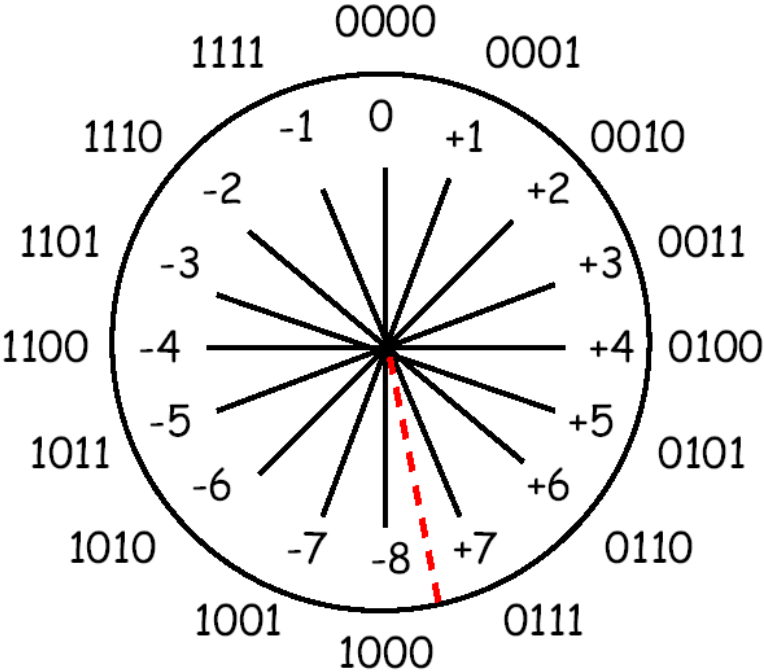
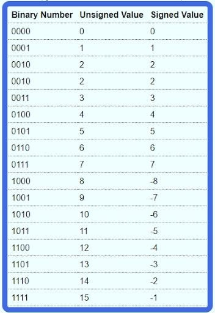

## Why Bit Manipulation Matters
Bit manipulation enables fast, memory-efficient, and elegant solutions by directly operating on binary data. It’s essential for competitive programming, system-level tasks, and algorithm optimization. **Bitwise operations take only 1–2 CPU cycles, while multiplication, division, and modulo can take 10–100+ cycles.**

Bit manipulation isn’t just an optimization—it’s a different way of thinking about problems. Master these techniques, and you'll unlock solutions that are both elegant and lightning-fast.

## Bitwise Operators

Python has **6 bitwise operators**:

- `&`  AND  
- `|`  OR  
- `^`  XOR  
- `~`  NOT (unary)  
- `<<` Left shift  
- `>>` Right shift  

Each binary operator has an assignment version (`&=`, `|=`, `^=`, `<<=`, `>>=`).  
The unary NOT (`~`) does **not**.

### Precedence (highest → lowest)

1. `~`  (Bitwise NOT)  
2. `<<`, `>>` (Shifts)  
3. `&`  (AND)  
4. `^`  (XOR)  
5. `|`  (OR)  

**Note:** Python bitwise operators work **only on integers**.

## Core Bit Terminology
| Term                            | Meaning                                                                                 |
| ------------------------------- | --------------------------------------------------------------------------------------- |
| **Bit**                         | A single binary digit (0 or 1).                                                         |
| **Set bit**                     | A bit with value `1`.                                                                   |
| **Unset bit** / **Cleared bit** | A bit with value `0`.                                                                   |
| **Flip**                        | To toggle a bit: 0 → 1 or 1 → 0.                                                        |
| **LSB (Least Significant Bit)** | The rightmost bit (smallest weight, `2^0`).                                             |
| **MSB (Most Significant Bit)**  | The leftmost bit in a fixed-width representation.                                       |
| **Bit position / index / Kth bit** | A 0-based index counted from the LSB.                                                |
| **Bitmask / Mask**              | A pattern of bits (like `0xF` = `1111`) used with AND/OR/XOR to extract or modify bits. |
| **Bit field**                   | A group of bits treated as a unit (often in structs/registers).                         |
| **Nibble**                      | 4 bits.                                                                                 |
| **Byte**                        | 8 bits.                                                                                 |
| **Word**                        | Depends on architecture (commonly 16/32/64 bits).                                       |

## Operations on Bits
| Term                        | Meaning                                                                        |
| --------------------------- | ------------------------------------------------------------------------------ |
| **AND (&)**                 | Keeps bits set in both operands.                                               |
| **OR ( \| )**               | Sets a bit if either operand has it set.                                       |
| **XOR ( ^ )**               | Sets a bit if operands differ.                                                 |
| **NOT (\~)**                | Flips all bits.                                                                |
| **Shift left (<<)**         | Moves bits to the left, filling with zeros.                                    |
| **Shift right (>>)**        | Moves bits to the right, filling with zeros (or sign bit in arithmetic shift). |
| **Arithmetic shift**        | Preserves sign bit on right shifts (signed numbers).                           |
| **Logical shift**           | Always fills with zero (unsigned numbers).                                     |
| **Rotate (circular shift)** | Bits shifted out are reintroduced at the other end.                            |

## Hardware / Low-level Terms
| Term             | Meaning                                                                      |
| ---------------- | ---------------------------------------------------------------------------- |
| **Flag bit**     | A bit that represents a condition (e.g., Zero flag, Carry flag in CPUs).     |
| **Control bit**  | A bit that controls hardware behavior (like enabling/disabling).             |
| **Status bit**   | A bit that reflects hardware state.                                          |
| **Sign bit**     | The MSB in signed integers (0 = positive, 1 = negative in two’s complement). |
| **Carry bit**    | Extra bit produced in addition beyond fixed width.                           |
| **Borrow bit**   | Similar in subtraction.                                                      |
| **Overflow bit** | Indicates arithmetic overflow.                                               |

## Properties and Tricks
| Term                                             | Meaning                                                         |
| ------------------------------------------------ | --------------------------------------------------------------- |
| **Hamming weight / Population count / popcount** | Number of set bits in a number.                                 |
| **Parity bit**                                   | Indicates whether the number of set bits is even or odd.        |
| **Hamming distance**                             | Number of differing bit positions between two numbers.          |
| **Bitmask DP**                                   | Using a number’s set bits to represent subsets or states.       |
| **Power of two**                                 | A number with exactly one set bit (`n & (n-1) == 0`).           |
| **Lowest set bit**                               | The rightmost set bit (`n & -n`).                               |
| **Highest set bit**                              | The leftmost set bit (often via log2 or shifts).                |
| **Trailing zeros**                               | Number of consecutive zeros at the LSB side.                    |
| **Leading zeros**                                | Number of consecutive zeros before the MSB.                     |
| **Bit packing**                                  | Storing multiple values in different parts of a single integer. |
| **Bit slicing**                                  | Extracting part of an integer using masks/shifts.               |

## Common Built-in Functions

### Number Base Conversions
**bin(n)** - Convert integer to binary string (e.g., bin(5) → '0b101')  
**hex(n)** - Convert integer to hexadecimal string    
**oct(n)** - Convert integer to octal string    
**int(string, base)** - Convert string from any base to integer     

### Integer Methods
**.bit_length()** - Number of bits needed to represent the integer (excluding sign)      
**.bit_count()** - Count of 1-bits in binary representation (Python 3.10+)    

## Binary number system

<table>
    <tr>
        <td width="60%">
            
        </td>
        <td width="40%">
            
        </td>
    </tr>
</table>

